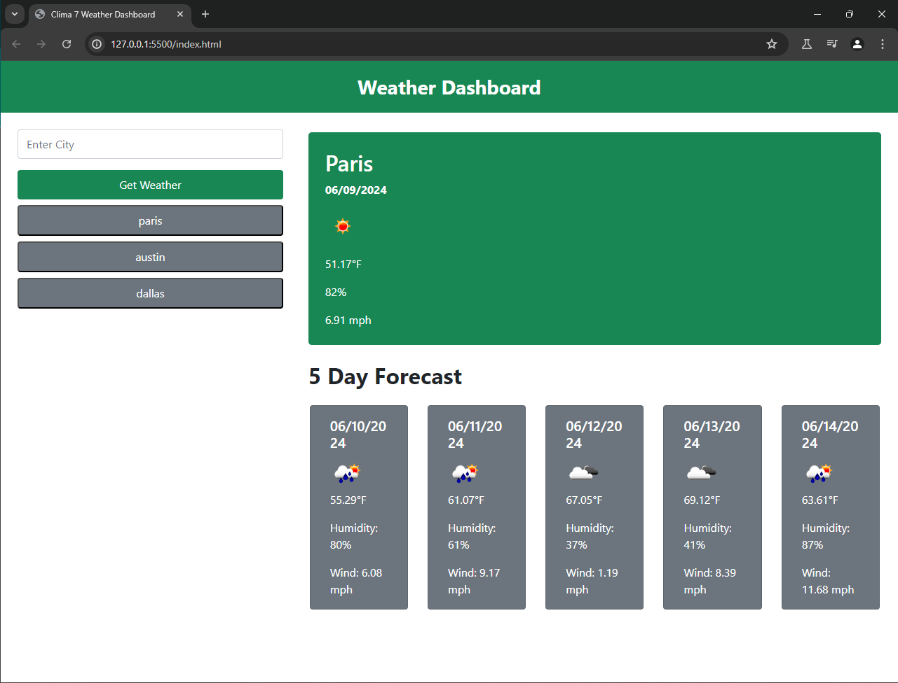

# Clima7
Server Side API Weather Dashboard

## Description

This dashboard uses the OpenWeatherAPI to retrieve current and forecasted weather data for searched cities, uses local storage to display history of searched cities as buttons to reference quickly if the user is on a different search.

## Usage

## Technologies
``
Bootstrap
``

``
Javascript
``

``
Open Weather Api
``

``
dayjs
``

## Credits

https://day.js.org/docs/en/display/format

https://getbootstrap.com/

https://openweathermap.org/forecast5

https://coding-boot-camp.github.io/full-stack/apis/how-to-use-api-keys

## License

[License: MIT](https://opensource.org/licenses/MIT)